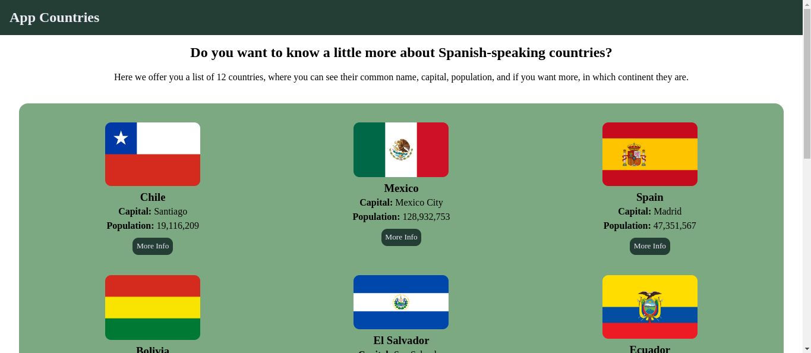

# PaisesApp

## Índice

* [1. Introducción](#1-introducción)
* [2. Resumen del proyecto](#1-resumen-del-proyecto)
* [3. Consideraciones técnicas](#3-consideraciones-técnicas)
* [4. Herramientas usadas](#1-herramientas-usadas)

***

## 1. Introducción
El presente proyecto nos permite consumir un API [REST COUNTRIES](https://restcountries.com/) para poder mostrar una lista de 12 países de habla hispana, de los cuales podemos observar mayor información.

## 2. Resumen del proyecto
Página web que muestra una lista de 12 países con sus respectivas capitales y población actual.
Así como la opción de ver el continente en el que se encuentra en un modal simple.

## 3. Consideraciones técnicas
- La lista de los países debe estar en "MainContent", utiliza una grilla.
- La API a utilizar es: https://restcountries.com/v3.1/lang/spa
- Cada contenedor de país deberá ser un web component reutilizable.
- Incluir hojas de estilo propias (CSS). Minimalista y a la vez atractivo.
- Dinamismo: al hacer click debe mostrarse un modal simple con el continente al que pertenece el país.
- No usar frameworks, solo JS nativo y CSS3.

## 4. Herramientas usadas
Para el desarrollo del presente proyecto se utilizó:
* [Git](https://git-scm.com/)
* [GitHub](https://github.com/)
* [GitHub Pages](https://pages.github.com/)